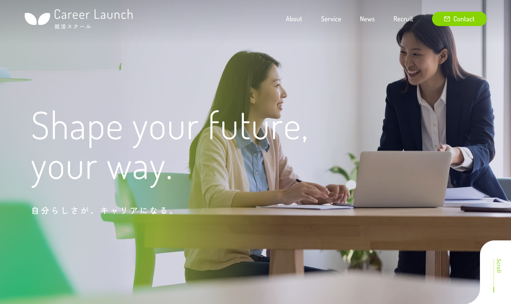

# 🌿 株式会社 Career Launch（架空サイト）

**🔗 デモ URL:** https://hiron-folio.com/portfolio/lp/career-launch/

キャリア支援スクール「Career Launch」のブランドサイトを、支給デザインをもとに静的サイトとして構築。

---

### 🖥 使用技術

HTML / SCSS / JavaScript

**使用ライブラリ:**

- GSAP - アニメーションライブラリ
- ScrollTrigger (GSAP プラグイン) - スクロール連動アニメーション
- SplitText (GSAP プラグイン) - テキストアニメーション
- Splide - スライダー機能
- Splide Extension Auto Scroll - スライダーの自動スクロール機能

### 🚀 制作ポイント

- TOP ＋下層 5 ページ（計 6 ページ）を 3 週間で実装
- GSAP を用いたアニメーション実装（ローディング、テキスト、スクロール演出、ヘッダー挙動）
- Splide を使った 2 種類のスライダー（オートスクロール・ユーザー操作型）
- デザイン再現性を重視し、余白やフォントサイズを **rem ベースで統一管理**
- SCSS をセクションごとに分割し、保守性の高いクラス設計
- JavaScript を機能ごとにモジュール化し、保守性を向上
- レスポンシブ対応（SP・PC）

## 🧭 開発環境（概要）

### 推奨エディターと拡張機能（Cursor / VS Code）

- **Live Sass Compiler**：SCSS のリアルタイムコンパイル
- **Prettier**：HTML / SCSS / JS / JSON 等のコード整形
